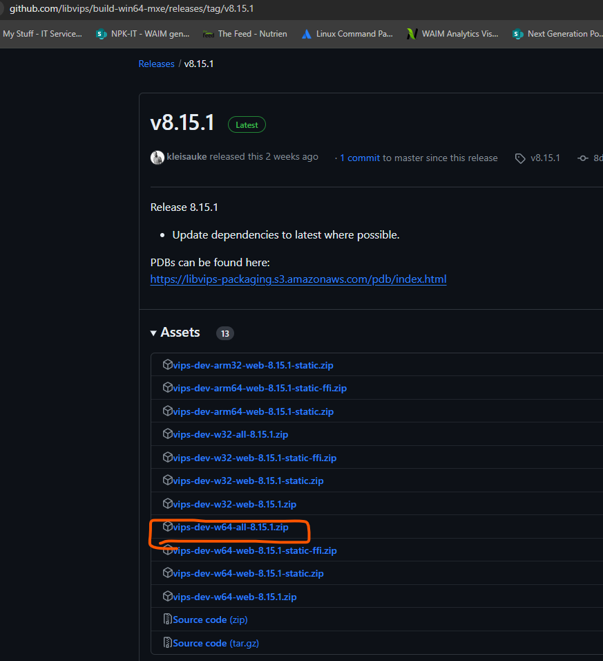

### Install pyvips
```
pip install pyvips 
```
### Installed succeffully
```
Enumerating objects: 24, done.
Counting objects: 100% (24/24), done.
Delta compression using up to 8 threads
Compressing objects: 100% (23/23), done.
Writing objects: 100% (24/24), 1.52 MiB | 1.37 MiB/s, done.
Total 24 (delta 1), reused 0 (delta 0), pack-reused 0
remote: Resolving deltas: 100% (1/1), done.
Collecting pyvips
  Downloading pyvips-2.2.2.tar.gz (51 kB)
     ━━━━━━━━━━━━━━━━━━━━━━━━━━━━━━━━━━━━━━━━ 51.3/51.3 kB 873.7 kB/s eta 0:00:00
  Preparing metadata (setup.py) ... done
Collecting cffi>=1.0.0 (from pyvips)
  Obtaining dependency information for cffi>=1.0.0 from https://files.pythonhosted.org/packages/73/dd/15c6f32166f0c8f97d8aadee9ac8f096557899f4f21448d2feb74cf4f210/cffi-1.16.0-cp39-cp39-win_amd64.whl.metadata
  Using cached cffi-1.16.0-cp39-cp39-win_amd64.whl.metadata (1.5 kB)
Collecting pycparser (from cffi>=1.0.0->pyvips)
  Using cached pycparser-2.21-py2.py3-none-any.whl (118 kB)
Using cached cffi-1.16.0-cp39-cp39-win_amd64.whl (181 kB)
Building wheels for collected packages: pyvips
  Building wheel for pyvips (setup.py) ... done
  Created wheel for pyvips: filename=pyvips-2.2.2-py2.py3-none-any.whl size=54845 sha256=f7854f90e64655fda800e05c7eb11d139fe9067dd6a4082c5155a4eac460323a
  Stored in directory: c:\users\mesoh\appdata\local\pip\cache\wheels\8f\a9\fe\9340ed21c7f591f988300b7a7b98987812dddcebf7d42cdd36
Successfully built pyvips
Installing collected packages: pycparser, cffi, pyvips
Successfully installed cffi-1.16.0 pycparser-2.21 pyvips-2.2.2

```


After running the `main.py` file shows the following error
## Error
```
Traceback (most recent call last):
  File "E:\My Research Work\Machine Learning Examples\pytorch-environment\venv4\lib\site-packages\pyvips\__init__.py", line 19, in <module>
    import _libvips
ModuleNotFoundError: No module named '_libvips'

During handling of the above exception, another exception occurred:

Traceback (most recent call last):
  File "E:\My Research Work\Machine Learning Examples\pytorch-environment\pillow_bangla_pyvips\main.py", line 4, in <module>
    import pyvips
  File "E:\My Research Work\Machine Learning Examples\pytorch-environment\venv4\lib\site-packages\pyvips\__init__.py", line 70, in <module>
    gobject_lib = ffi.dlopen(_gobject_libname)
  File "E:\My Research Work\Machine Learning Examples\pytorch-environment\venv4\lib\site-packages\cffi\api.py", line 150, in dlopen
    lib, function_cache = _make_ffi_library(self, name, flags)
  File "E:\My Research Work\Machine Learning Examples\pytorch-environment\venv4\lib\site-packages\cffi\api.py", line 832, in _make_ffi_library
    backendlib = _load_backend_lib(backend, libname, flags)
  File "E:\My Research Work\Machine Learning Examples\pytorch-environment\venv4\lib\site-packages\cffi\api.py", line 827, in _load_backend_lib
    raise OSError(msg)
OSError: cannot load library 'libgobject-2.0-0.dll': error 0x7e.  Additionally, ctypes.util.find_library() did not manage to locate a library called 'libgobject-2.0-0.dll'

```

### Download the vips release:
Go to the following link:
https://github.com/libvips/libvips/releases

which will look some thing like this:



Now based on your following system download the suitable file, mine is windows10 64-bits so I downloaded that file. 

Download this file: 
`vips-dev-w64-all-8.15.1.zip`

After the downloading the file go any location and save it > extract the files which will give you folder name `vips-dev-8.15.1`

### Setup path in environment variables:

`E:\My Research Work\Machine Learning Examples\pytorch-environment\pillow_bangla_pyvips\vips-dev-8.15\bin`

Now go to your environment variables & paste it.
### For user variables:
ThisPc > Advanced System settings > Environment Variables > User variabes > Path > Edit > New > Paste > Ok
### For System variables:
ThisPc > Advanced System settings > Environment Variables > Sytem variabes > Path > Edit > New > Paste > Ok


Almost done with the process

*** Restart your system ***


## Run the code
```
python main.py

```
### output


### References:
* https://www.infinitycodex.in/how-to-put-hindi-text-on-images-using